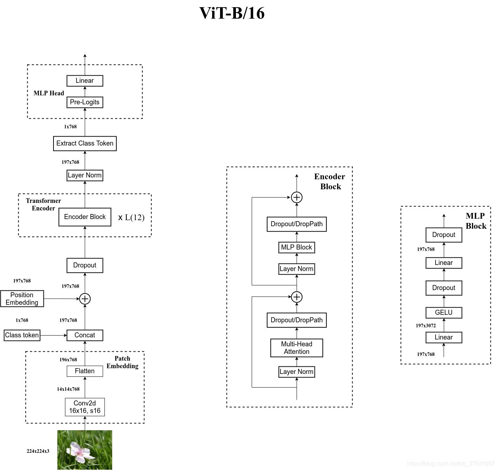

# Working Log at Fit 3-523

## Reference Sites

1. [PyTorch Official Tutorial in Chinese](https://pytorch123.com)
2. [Jittor Official Website](https://cg.cs.tsinghua.edu.cn/jittor)
3. [Some Models Trained and Tested on Cifar100 Dataset](https://github.com/weiaicunzai/pytorch-cifar100/tree/master)

## CLIP

[CLIP github repository](https://github.com/openai/CLIP/blob/main)

### Introduction

1. Working process:
    - Pre-train.
    - Create dataset classfier from label text based on a specific task.
    - Use for zero-shot prediction.
    

### Baseline Testing

1. Zero-shot Version(Code from CLIP, other from open-clip. Traing-free baseline):
    - Install: `python setup.py develop`
    - Dataset: `~/.cache/cifar-100-python` on server
    - Problems Occurred:
        - Model downdoading failed due to no accesse to Internet: Load the local model using library `open_clip`.
        - Input is in GPU but the model is in CPU: [Error: Input type (torch.cuda.FloatTensor) and weight type (torch.FloatTensor) should be the same.](https://blog.csdn.net/qq_38832757/article/details/113630383)
    - code:

    ```python
    import os
    import open_clip
    import torch
    from torchvision.datasets import CIFAR100

    # Load the model
    device = "cuda" if torch.cuda.is_available() else "cpu"
    model, _, preprocess = open_clip.create_model_and_transforms('ViT-B-32',pretrained='laion2b_s34b_b79k')
    model.cuda()
    print("Model loaded.")

    # Download the dataset
    cifar100 = CIFAR100(root=os.path.expanduser("~/.cache"), download=True, train=False)
    print("Dataset downloaded.")

    # Prepare the inputs
    image, class_id = cifar100[3637]
    image_input = preprocess(image).unsqueeze(0).to(device)
    text_inputs = torch.cat([open_clip.tokenize(f"a photo of a {c}") for c in cifar100.classes]).to(device)
    print("Input prepared.")

    # Calculate features
    with torch.no_grad():
        image_features = model.encode_image(image_input)
        text_features = model.encode_text(text_inputs)

    # Pick the top 5 most similar labels for the image
    image_features /= image_features.norm(dim=-1, keepdim=True)
    text_features /= text_features.norm(dim=-1, keepdim=True)
    similarity = (100.0 * image_features @ text_features.T).softmax(dim=-1)
    values, indices = similarity[0].topk(5)

    # Print the result
    print("\nTop predictions:\n")
    for value, index in zip(values, indices):
        print(f"{cifar100.classes[index]:>16s}: {100 * value.item():.2f}%")
    ```

2. Traing Baseline:
    - Logistic Regression: Accuracy: 57% to 58%

    ```python
    import torch
    from PIL import Image
    import open_clip
    import os
    from tqdm import tqdm
    import argparse
    import numpy as np
    from sklearn.linear_model import LogisticRegression
    import torch.nn as nn
    import torch.nn.functional as F
    import torch.optim as optim

    parser = argparse.ArgumentParser()
    parser.add_argument('--split', type=str, default='A')

    args = parser.parse_args()

    # Load model
    GPU_num = 2
    model, _, preprocess = open_clip.create_model_and_transforms(
        'ViT-B-32', pretrained='laion2b_s34b_b79k')
    model = model.cuda()
    tokenizer = open_clip.get_tokenizer('ViT-B-32')
    print('Model loaded')

    # Remove prefix
    classes = open('logs/classes.txt').read().splitlines()
    new_classes = []
    for c in classes:
        c = c.split(' ')[0]
        if c.startswith('Animal'):
            c = c[7:]
        if c.startswith('Thu-dog'):
            c = c[8:]
        if c.startswith('Caltech-101'):
            c = c[12:]
        if c.startswith('Food-101'):
            c = c[9:]
        c = 'a photo of ' + c
        new_classes.append(c)

    split = 'TestSet' + args.split

    #  text features
    text = tokenizer(new_classes).cuda()
    text_features = model.encode_text(text)
    text_features /= text_features.norm(dim=-1, keepdim=True)
    text_features = text_features.half()

    # Training dataset loading
    imgs_dir = 'processed_dataset/Trainset/'
    train_labels = open('logs/train.txt').read().splitlines()
    imgs = [l.split(' ')[0] for l in train_labels]
    train_labels = [torch.tensor([int(l.split(' ')[1])]) for l in train_labels]
    print('Training dataset loaded')

    # Calculate image features of training data
    print('Training dataset processing:')
    train_features = []
    with torch.no_grad(), torch.cuda.amp.autocast():
        for img in tqdm(imgs):
            image = Image.open(img)
            image = preprocess(image).unsqueeze(0).cuda()
            image_features = model.encode_image(image)
            image_features /= image_features.norm(dim=-1, keepdim=True)
            train_features.append(image_features)

    train_features = torch.cat(train_features).cpu().numpy()
    train_labels = torch.cat(train_labels).cpu().numpy()

    # Testing dataset loading
    imgs_dir = 'processed_dataset/' + split
    test_labels = open('logs/test_{}.txt'.format(args.split.lower())).read().splitlines()
    imgs = [l.split(' ')[0] for l in test_labels]
    test_labels = [torch.tensor([int(l.split(' ')[1])]) for l in test_labels]
    print('Testing dataset loaded')

    # Testing data processing
    test_features = []
    with torch.no_grad(), torch.cuda.amp.autocast():
        for img in tqdm(imgs):
            img_path = os.path.join(imgs_dir, img)
            image = Image.open(img_path)
            image = preprocess(image).unsqueeze(0).cuda().half()
            image_features = model.encode_image(image)
            image_features /= image_features.norm(dim=-1, keepdim=True)
            test_features.append(image_features)

    test_features = torch.cat(test_features).cpu().numpy()
    test_labels = torch.cat(test_labels).cpu().numpy()

    classifier = LogisticRegression(random_state=0, C=9.0, max_iter=1000, verbose=1)
    classifier.fit(train_features, train_labels)

    # Calculate accuracy
    predictions = classifier.predict(test_features)
    accuracy = np.mean((test_labels == predictions).astype(float)) * 100.
    print(f"Accuracy = {accuracy:.3f}%")
    ```

    - Linear: Accuracy: 60%

    ```python
    import torch
    from PIL import Image
    import open_clip
    import os
    from tqdm import tqdm
    import argparse
    import numpy as np
    # from sklearn.linear_model import LogisticRegression
    import torch.nn as nn
    import torch.nn.functional as F
    import torch.optim as optim

    parser = argparse.ArgumentParser()
    parser.add_argument('--split', type=str, default='A')

    args = parser.parse_args()

    # Load model
    GPU_num = 2
    model, _, preprocess = open_clip.create_model_and_transforms(
        'ViT-B-32', pretrained='laion2b_s34b_b79k')
    model = model.cuda()
    tokenizer = open_clip.get_tokenizer('ViT-B-32')
    print('Model loaded')

    # Remove prefix
    classes = open('logs/classes.txt').read().splitlines()
    new_classes = []
    for c in classes:
        c = c.split(' ')[0]
        if c.startswith('Animal'):
            c = c[7:]
        if c.startswith('Thu-dog'):
            c = c[8:]
        if c.startswith('Caltech-101'):
            c = c[12:]
        if c.startswith('Food-101'):
            c = c[9:]
        c = 'a photo of ' + c
        new_classes.append(c)

    split = 'TestSet' + args.split

    # Training dataset loading
    imgs_dir = 'processed_dataset/Trainset/'
    train_labels = open('/home/zy/few_shot_dataset/train.txt').read().splitlines()
    imgs = [l.split(' ')[0] for l in train_labels]
    train_labels = [torch.tensor([int(l.split(' ')[1])]) for l in train_labels]

    imgs_dir = 'processed_dataset/' + split
    test_labels = open('logs/test_{}.txt'.format(
        args.split.lower())).read().splitlines()
    test_imgs = [l.split(' ')[0] for l in test_labels]
    test_labels = [int(l.split(' ')[1]) for l in test_labels]

    print('Training dataset loaded')

    print('Training dataset processing:')
    train_features = []
    test_features = []

    # save to .cache
    if not os.path.exists('.cache'):
        os.makedirs('.cache')

    if os.path.exists('.cache/train_features.pt') and \
        os.path.exists('.cache/test_features.pt') and \
        os.path.exists('.cache/train_labels.pt') and \
        os.path.exists('.cache/test_labels.pt'):
        train_features = torch.load('.cache/train_features.pt')
        test_features = torch.load('.cache/test_features.pt')
        train_labels = torch.load('.cache/train_labels.pt')
        test_labels = torch.load('.cache/test_labels.pt')
    else:
        with torch.no_grad(), torch.cuda.amp.autocast():
            for img in tqdm(imgs):
                image = Image.open(img)
                image = preprocess(image).unsqueeze(0).cuda()
                image_features = model.encode_image(image)
                image_features /= image_features.norm(dim=-1, keepdim=True)
                train_features.append(image_features)
            for img in tqdm(test_imgs):
                image = Image.open(os.path.join(imgs_dir, img))
                image = preprocess(image).unsqueeze(0).cuda()
                image_features = model.encode_image(image)
                image_features /= image_features.norm(dim=-1, keepdim=True)
                test_features.append(image_features)


    torch.save(train_features, '.cache/train_features.pt')
    torch.save(test_features, '.cache/test_features.pt')
    torch.save(train_labels, '.cache/train_labels.pt')
    torch.save(test_labels, '.cache/test_labels.pt')

    class FeatureDataset(torch.utils.data.Dataset):

        def __init__(self, features, labels):
            self.features = features
            self.labels = labels

        def __len__(self):
            return len(self.features)

        def __getitem__(self, idx):
            return self.features[idx], self.labels[idx]


    train_dataset = FeatureDataset(train_features, train_labels)
    train_loader = torch.utils.data.DataLoader(train_dataset,
                                            batch_size=32,
                                            shuffle=True)

    test_dataset = FeatureDataset(test_features, test_labels)
    test_loader = torch.utils.data.DataLoader(test_dataset,
                                            batch_size=1,
                                            shuffle=False)


    # Define the new network
    class Net(nn.Module):

        def __init__(self):
            super(Net, self).__init__()
            self.linear1 = nn.Linear(512, 2048)
            self.linear2 = nn.Linear(2048, 4096)
            self.linear3 = nn.Linear(4096, 512)
            text = tokenizer(new_classes).cuda()
            with torch.no_grad():
                self.text_features = model.encode_text(text)
                self.text_features /= self.text_features.norm(dim=-1, keepdim=True)
                self.text_features = self.text_features.half()

        def forward(self, x):
            x = self.linear1(x)
            x = self.linear2(x)
            x = self.linear3(x)
            x = x / x.norm(dim=-1, keepdim=True)
            x = (100.0 * x @ self.text_features.T).softmax(dim=-1)
            return x


    def test(net, test_loader):
        # Testing, return accuracy
        net.eval()
        correct = 0
        print('Testing:')
        with torch.no_grad(), torch.cuda.amp.autocast():
            for i in test_loader:
                inputs, labels = i
                inputs = inputs.cuda().half().squeeze(1)
                labels = labels.cuda()

                outputs = net(inputs)
                _, predicted = torch.max(outputs.data, 1)
                correct += (predicted == labels).sum().item()
        accuracy = 100 * correct / len(test_loader.dataset)
        print('Accuracy of the network on the %d test images: %.2f %%' %
            (len(test_loader.dataset), accuracy))


    net = Net()
    net = net.cuda().half()
    net.train()

    # Loss function
    criterion = nn.CrossEntropyLoss()
    optimizer = optim.SGD(net.parameters(), lr=1e-3, momentum=0.9)

    # Training
    print('Training:')
    pbar = tqdm(total=len(train_loader))
    for epoch in tqdm(range(1000)):
        running_loss = 0
        for i in train_loader:

            inputs, labels = i
            inputs = inputs.cuda().half().squeeze(1)
            labels = labels.cuda().squeeze(1)

            optimizer.zero_grad()

            outputs = net(inputs)
            loss = criterion(outputs, labels)
            loss.backward()
            optimizer.step()
        running_loss += loss.item()
        pbar.set_description('Epoch %d, Loss: %.3f' %
                            (epoch + 1, running_loss / len(train_loader)))
        if epoch % 50 == 49:
            test(net, test_loader)
    ```

## Addition: Dataloader

1. Reference: [Dataloader](https://github.com/weiaicunzai/pytorch-cifar100/tree/master)

## Transformer

### Attention Is All You Need

1. Original paper: [Attention Is All You Need](https://proceedings.neurips.cc/paper_files/paper/2017/file/3f5ee243547dee91fbd053c1c4a845aa-Paper.pdf)
2. Vedio: [Interpretation of Attention Is All You Need](https://www.bilibili.com/video/BV1pu411o7BE/?spm_id_from=333.337.search-card.all.click)

### Vision Transformer (ViT)

1. Source:
    - [Vision-Transformer-ViT_asyml](https://github.com/asyml/vision-transformer-pytorch)
    - [Vision-Transformer-ViT_Kaicheng-Yang0828](https://github.com/Kaicheng-Yang0828/Vision-Transformer-ViT)
2. Original Paper: [An Image Is Worth 16x16 Words: Transformer for Image Recongnition at Scale](https://arxiv.org/pdf/2010.11929.pdf)
3. Video: [Interpretation of ViT](https://www.bilibili.com/video/BV15P4y137jb?vd_source=f913c8d5eba4923e55076f4509271cd9)
4. Referrence: [Vision Transformer Details](https://blog.csdn.net/qq_37541097/article/details/118242600)
5. Architecture:
    
    
    - Linear Projection of Flattened Patches(Embedding Layer):
        - For the standard Transformer module, the input is required to be a sequence of vectors(a 2d matrix `[num_vectors, dim_vectors]`).
        - For image data, the data format is `[H, W, C]`, which is not accepted by Tansformer. Therefore, an `Embedding Layer` is needed to do a transformation on the data.
        - Take ViT-B16 as an example, the input image(256x256) is divided into 196 16x16 patches. Then each patch is mapped to a one-dimensional vector by a linear mapping(In ViT-B16, that is from `[16, 16, 3]` to `[768]`.). In the code implementation, this is done directly through a convolutional layer.

        ```text
                        Original image [224, 244, 3]
                                      ||
                                      \/
        Conv(kernel_size=16, stride=16, input_channels=3, output_channels=768)
                                      ||
                                      \/
                              [14, 14, 768] Tensor
                                      ||
                                      \/
                               [196, 768] Tensor
        ```

        - Adding `[class] token` as well as `Position Embedding` before entering the Transformer Encoder is needed. `[class]token` is a trainable parameter(a vector). Take ViT-B16 as an example, `[class]token` is a vector of length 768, stitched together with the tokens previously generated from the picture: `Car([1, 768], [196, 768]) -> [197, 768]`. `Position Embedding` is alaso a trainable paramter(shape: `[197, 768]`).
        - As a conclusion, the out put of the Embedding Layer is a `[patches_num + 1, output_channels]` tensor.
    - Transformer Encoder - Stack of Encoder Block
    
    - MLP Head(Used for eventual classification)
        - All we need is the classification information. Therefore, only the corresponding result generated by `[class]token` needs to be extracted. (In ViT-B16, that is extracting `[1, 768]` from `[197, 768]`.)
        - Let the extracted tensor be the input of MLP Head, the output should be the final classification result.
6. Implementation:
    - PyTorch Version: [model.py from asyml's github](https://github.com/asyml/vision-transformer-pytorch/blob/main/src/model.py)

    ```python
    import torch
    import torch.nn as nn
    import torch.nn.functional as F
    import numpy as np

    class PositionEmbs(nn.Module):
        def __init__(self, num_patches, emb_dim, dropout_rate=0.1):
            super(PositionEmbs, self).__init__()
            self.pos_embedding = nn.Parameter(torch.randn(1, num_patches + 1, emb_dim))
            if dropout_rate > 0:
                self.dropout = nn.Dropout(dropout_rate)
            else:
                self.dropout = None

        def forward(self, x):
            out = x + self.pos_embedding

            if self.dropout:
                out = self.dropout(out)

            return out


    class MlpBlock(nn.Module):
        """ Transformer Feed-Forward Block """
        def __init__(self, in_dim, mlp_dim, out_dim, dropout_rate=0.1):
            super(MlpBlock, self).__init__()

            # init layers
            self.fc1 = nn.Linear(in_dim, mlp_dim)
            self.fc2 = nn.Linear(mlp_dim, out_dim)
            self.act = nn.GELU()
            if dropout_rate > 0.0:
                self.dropout1 = nn.Dropout(dropout_rate)
                self.dropout2 = nn.Dropout(dropout_rate)
            else:
                self.dropout1 = None
                self.dropout2 = None

        def forward(self, x):

            out = self.fc1(x)
            out = self.act(out)
            if self.dropout1:
                out = self.dropout1(out)

            out = self.fc2(out)
            out = self.dropout2(out)
            return out


    class LinearGeneral(nn.Module):
        def __init__(self, in_dim=(768,), feat_dim=(12, 64)):
            super(LinearGeneral, self).__init__()

            self.weight = nn.Parameter(torch.randn(*in_dim, *feat_dim))
            self.bias = nn.Parameter(torch.zeros(*feat_dim))

        def forward(self, x, dims):
            a = torch.tensordot(x, self.weight, dims=dims) + self.bias
            return a


    class SelfAttention(nn.Module):
        def __init__(self, in_dim, heads=8, dropout_rate=0.1):
            super(SelfAttention, self).__init__()
            self.heads = heads
            self.head_dim = in_dim // heads
            self.scale = self.head_dim ** 0.5

            self.query = LinearGeneral((in_dim,), (self.heads, self.head_dim))
            self.key = LinearGeneral((in_dim,), (self.heads, self.head_dim))
            self.value = LinearGeneral((in_dim,), (self.heads, self.head_dim))
            self.out = LinearGeneral((self.heads, self.head_dim), (in_dim,))

            if dropout_rate > 0:
                self.dropout = nn.Dropout(dropout_rate)
            else:
                self.dropout = None

        def forward(self, x):
            b, n, _ = x.shape

            q = self.query(x, dims=([2], [0]))
            k = self.key(x, dims=([2], [0]))
            v = self.value(x, dims=([2], [0]))

            q = q.permute(0, 2, 1, 3)
            k = k.permute(0, 2, 1, 3)
            v = v.permute(0, 2, 1, 3)

            attn_weights = torch.matmul(q, k.transpose(-2, -1)) / self.scale
            attn_weights = F.softmax(attn_weights, dim=-1)
            out = torch.matmul(attn_weights, v)
            out = out.permute(0, 2, 1, 3)

            out = self.out(out, dims=([2, 3], [0, 1]))

            return out


    class EncoderBlock(nn.Module):
        def __init__(self, in_dim, mlp_dim, num_heads, dropout_rate=0.1, attn_dropout_rate=0.1):
            super(EncoderBlock, self).__init__()

            self.norm1 = nn.LayerNorm(in_dim)
            self.attn = SelfAttention(in_dim, heads=num_heads, dropout_rate=attn_dropout_rate)
            if dropout_rate > 0:
                self.dropout = nn.Dropout(dropout_rate)
            else:
                self.dropout = None
            self.norm2 = nn.LayerNorm(in_dim)
            self.mlp = MlpBlock(in_dim, mlp_dim, in_dim, dropout_rate)

        def forward(self, x):
            residual = x
            out = self.norm1(x)
            out = self.attn(out)
            if self.dropout:
                out = self.dropout(out)
            out += residual
            residual = out

            out = self.norm2(out)
            out = self.mlp(out)
            out += residual
            return out


    class Encoder(nn.Module):
        def __init__(self, num_patches, emb_dim, mlp_dim, num_layers=12, num_heads=12, dropout_rate=0.1, attn_dropout_rate=0.0):
            super(Encoder, self).__init__()

            # positional embedding
            self.pos_embedding = PositionEmbs(num_patches, emb_dim, dropout_rate)

            # encoder blocks
            in_dim = emb_dim
            self.encoder_layers = nn.ModuleList()
            for i in range(num_layers):
                layer = EncoderBlock(in_dim, mlp_dim, num_heads, dropout_rate, attn_dropout_rate)
                self.encoder_layers.append(layer)
            self.norm = nn.LayerNorm(in_dim)

        def forward(self, x):

            out = self.pos_embedding(x)

            for layer in self.encoder_layers:
                out = layer(out)

            out = self.norm(out)
            return out


    class VisionTransformer(nn.Module):
        """ Vision Transformer """
        def __init__(self,
                    image_size=(256, 256),
                    patch_size=(16, 16),
                    emb_dim=768,
                    mlp_dim=3072,
                    num_heads=12,
                    num_layers=12,
                    num_classes=1000,
                    attn_dropout_rate=0.0,
                    dropout_rate=0.1,
                    feat_dim=None):
            super(VisionTransformer, self).__init__()
            h, w = image_size

            # embedding layer
            fh, fw = patch_size
            gh, gw = h // fh, w // fw
            num_patches = gh * gw
            self.embedding = nn.Conv2d(3, emb_dim, kernel_size=(fh, fw), stride=(fh, fw))
            # class token
            self.cls_token = nn.Parameter(torch.zeros(1, 1, emb_dim))

            # transformer
            self.transformer = Encoder(
                num_patches=num_patches,
                emb_dim=emb_dim,
                mlp_dim=mlp_dim,
                num_layers=num_layers,
                num_heads=num_heads,
                dropout_rate=dropout_rate,
                attn_dropout_rate=attn_dropout_rate)

            # classfier
            self.classifier = nn.Linear(emb_dim, num_classes)

        def forward(self, x):
            emb = self.embedding(x)     # (n, c, gh, gw)
            emb = emb.permute(0, 2, 3, 1)  # (n, gh, hw, c)
            b, h, w, c = emb.shape
            emb = emb.reshape(b, h * w, c)

            # prepend class token
            cls_token = self.cls_token.repeat(b, 1, 1)
            emb = torch.cat([cls_token, emb], dim=1)

            # transformer
            feat = self.transformer(emb)

            # classifier
            logits = self.classifier(feat[:, 0])
            return logits
    ```

    - Jittor Version(training from scratch):

    ```python
    import jittor as jt
    import os
    from jittor import nn, Module
    import jittor.transform as transforms
    import numpy as np
    from tqdm import tqdm
    from jittor.dataset import CIFAR100
    from jittor_attention import MultiheadAttention
    import time

    data_root = '~/.cache/'
    batch_size = 64
    lr = 1e-2
    momentum = 0.9
    epochs = 200

    jt.flags.use_cuda = 1

    transform = transforms.Compose([
        # transforms.RandomCrop(28),
        # transforms.RandomHorizontalFlip(),
        transforms.Resize(size=(256, 256)),
        transforms.ImageNormalize(mean=[0.5, 0.5, 0.5], std=[0.5, 0.5, 0.5])
    ])

    # Use Cifar100 dataset
    train_loader = CIFAR100(os.path.expanduser(data_root), train=True, transform=transform, download=True).set_attrs(batch_size=batch_size, shuffle=True)
    test_loader = CIFAR100(os.path.expanduser(data_root), train=False, transform=transform, download=True).set_attrs(shuffle=True)

    class PositionalEmbedding(Module):
        def __init__(self, num_patches, emb_dim, dropout_rate=0.1):
            super(PositionalEmbedding, self).__init__()
            self.pos_embedding = nn.Parameter(jt.randn(1, num_patches + 1, emb_dim))
            if dropout_rate > 0.0:
                self.dropout = nn.Dropout(dropout_rate)
            else:
                self.dropout = None

        def execute(self, x):
            output = x + self.pos_embedding
            if self.dropout:
                output = self.dropout(output)
            return output

    class MLPBlock(Module):
        def __init__(self, in_dim, mlp_dim, out_dim, dropout_rate=0.1):
            super(MLPBlock, self).__init__()

            self.fc1 = nn.Linear(in_dim, mlp_dim)
            self.fc2 = nn.Linear(mlp_dim, out_dim)
            self.act = nn.GELU()
            if dropout_rate > 0.0:
                self.dropout1 = nn.Dropout(dropout_rate)
                self.dropout2 = nn.Dropout(dropout_rate)
            else:
                self.dropout1 = None
                self.dropout2 = None

        def execute(self, x):
            output = self.fc1(x)
            output = self.act(output)
            if self.dropout1:
                output = self.dropout1(output)
            output = self.fc2(output)
            if self.dropout2:
                output = self.dropout2(output)
            
            return output

    class EncoderBlock(Module):
        def __init__(self, in_dim, mlp_dim, num_heads, dropout_rate=0.1, attn_dropout_rate=0.1):
            super(EncoderBlock, self).__init__()

            self.norm1 = nn.LayerNorm(in_dim)
            self.attn = MultiheadAttention(embed_dim=in_dim, num_heads=num_heads, dropout=attn_dropout_rate, batch_first=True)
            if dropout_rate > 0.0:
                self.dropout = nn.Dropout(dropout_rate)
            else:
                self.dropout = None
            self.norm2 = nn.LayerNorm(in_dim)
            self.mlp = MLPBlock(in_dim, mlp_dim, in_dim, dropout_rate)

        def execute(self, x):
            residual = x
            output = self.norm1(x)
            output = self.attn(output, output, output)
            if self.dropout:
                output = self.dropout(output[0])
            output += residual
            residual = output

            output = self.norm2(output)
            output = self.mlp(output)
            output += residual

            return output

    class Encoder(Module):
        def __init__(self, num_patches, emb_dim, mlp_dim, num_layers=12, num_heads=12, dropout_rate=0.1, attn_dropout_rate=0.0):
            super(Encoder, self).__init__()
            
            self.pos_embdding = PositionalEmbedding(num_patches, emb_dim, dropout_rate)

            in_dim = emb_dim
            self.encoder_layers = nn.ModuleList()
            for i in range(num_layers):
                layer = EncoderBlock(in_dim, mlp_dim, num_heads, dropout_rate, attn_dropout_rate)
                self.encoder_layers.append(layer)
            self.norm = nn.LayerNorm(in_dim)
        
        def execute(self, x):
            output = self.pos_embdding(x)
            
            for layer in self.encoder_layers:
                output = layer(output)

            output = self.norm(output)

            return output

    class VisionTransformer(Module):
        def __init__(self,
                    img_size=(256, 256),
                    patch_size=(16, 16),
                    emb_dim=768,
                    mlp_dim=3072,
                    num_heads=12,
                    num_layers=12,
                    num_classes=100,
                    attn_dropout_rate=0.0,
                    dropout_rate=0.1,
                    feat_dim=None):
            super(VisionTransformer, self).__init__()
            h, w = img_size

            # embedding layer
            fh, fw = patch_size
            gh, gw = h // fh, w // fw
            num_patches = gh * gw
            self.embedding = nn.Conv(3, emb_dim, kernel_size=(fh, fw), stride=(fh, fw))

            # class token
            self.cls_token = nn.Parameter(jt.zeros(1, 1, emb_dim))

            # transfromer encoder
            self.encoder = Encoder(
                num_patches,
                emb_dim,
                mlp_dim,
                num_layers,
                num_heads,
                dropout_rate,
                attn_dropout_rate)
            
            # classifier (MLP Head is not used)
            self.classifier = nn.Linear(emb_dim, num_classes)

        def execute(self, x):
            emb = self.embedding(x)
            emb = emb.permute(0, 2, 3, 1)
            b, h, w, c = emb.shape
            emb = emb.reshape(b, h * w, c)

            cls_token = self.cls_token.repeat(b, 1, 1)
            emb = jt.cat([cls_token, emb], dim=1)

            feat = self.encoder(emb)

            logits = self.classifier(feat[:, 0])

            return logits
        
    all_acc = []

    def train(model, train_loader, loss_func, optimizer, epoch, f):
        t1 = time.time()
        loss_epoch = []

        model.train()

        for batch_idx, (inputs, labels) in enumerate(train_loader):
            outputs = model(inputs)
            loss = loss_func(outputs, labels)
            optimizer.step(loss)
            loss_epoch.append(loss.numpy()[0])
            data = f'Train epoch {epoch} [{(batch_idx + 1) * batch_size}/{len(train_loader)}]\tLoss: {loss.numpy()[0]}'
            print(data)
            f.write(data + '\n')
        t2 = time.time()
        data = data = f'Train epoch {epoch} average loss: {sum(loss_epoch) / len(loss_epoch)}   Time cost: {(t2-t1)/6e7}min'
        print(data)
        f.write(data + '\n')

    def test(model, test_loader, epoch, f):
        model.eval()

        correct = 0
        total = 0
        accuracy = []

        for _, (inputs, labels) in tqdm(enumerate(test_loader)):
            batch_size = inputs.shape[0]
            outputs = model(inputs)
            pred = np.argmax(outputs.data, axis=1)
            acc = np.sum(labels.data==pred)
            correct += acc
            total += batch_size
            accuracy.append(acc / batch_size * 100)
        
        all_acc.append(sum(accuracy) / len(accuracy))
        data = f'Test epoch {epoch} accuracy: {sum(accuracy) / len(accuracy)}%'
        print(data)
        f.write(data + '\n')

    if __name__ == '__main__':
        with open('Res.txt', 'w') as f:
            vit = VisionTransformer()
            loss_func = nn.CrossEntropyLoss()
            optimizer = nn.SGD(params=vit.parameters(), lr=lr, momentum=momentum)

            for epoch in range(epochs):
                train(vit, train_loader, loss_func, optimizer, epoch, f)
                test(vit, test_loader, epoch, f)
                if(all_acc[len(all_acc) - 1] >= max(all_acc)):
                    vit.save('./ViT.pkl')

            print(f'Accuracy on all data in each epoch: {all_acc}')
            f.write(f'Accuracy on all data in each epoch: {all_acc}\n')
    ```

7. Result
    - When training from scratch, the accuracy is not satisfying. (50%, 30 epoches approximately) The loss of the network declines extremely slow.
    - When training based on pretrained model, the accuracy reaches 98% after ont epoch using pytorch version from Kaicheng-Yang0828's github.

## CNN

### ResNet

1. Original Paper: [Deep Resdual Learning for Image Recognition](https://arxiv.org/pdf/1512.03385.pdf)
    - Introduction:
        - When deeper nerworks are able to start converging, accuracy gets saturated and then degrades rapidly, which is not caused by overfitting. Adding more layers to a suitably deep model leads to higher training error.
        - Deep residual learning framework:

        ```text
                    x ||----------------+
                      \/                |
            +--------------------+      |
            |    weight layer    |      |
            +--------------------+      |
                      ||  relu          |
                      \/                |
            +--------------------+      |
            |    weight layer    |      |
            +--------------------+      |
                      ||                |
                      \/                |
                    +----+              |
          F(x) + x  | +  |<-------------+
                    +----+
                      ||  relu
                      \/  
        ```

    - ResNet 34 Architecture:

    

2. PyTorch Version: [resnet.py (Different scale of ResNet included)](https://github.com/weiaicunzai/pytorch-cifar100/blob/master/models/resnet.py)

    ```python
    # ResNet34 below

    import torch
    import torch.nn as nn

    class BasicBlock(nn.Module):
        expansion = 1
        """Basic block for resnet 18 and 34"""
        def __init__(self, in_channels, out_channels, stride=1):
            super.__init__()

            # residual function
            self.residual_funtion = nn.Sequential(
                nn.Conv2d(in_channels, out_channels, kernel_size=3, stride=stride, padding=1, bias=False),
                nn.BatchNorm2d(out_channels),
                nn.ReLU(inplace=True),
                nn.Conv2d(out_channels, out_channels * BasicBlock, kernel_size=3, padding=1, bias=False),
                nn.BatchNorm2d(out_channels * BasicBolck.expansion)
            )

            self.shortcut = nn.Sequential()

            if stride != 1 or in_channels != BasicBlock.expansion * out_channels:
                self.shortcut = nn.Sequential(
                    nn.Conv2d(in_channels, out_channels * BackBlock.expansion, kernel_size=1, stride=stride, bias=False),
                    nn.BatchNorm2d(out_channels * BasicBlock.expansion)
                )

    class RenNet34(nn.Module):
        def __init__(self, block, num_block, num_classes=100):
            super.__init__()

            self.in_channels = 64

            self.conv1 = nn.Sequential(
                nn.Conv2d(3, 64, kernel_size=3, padding=1, bias=False),
                nn.BatchNorm2d(64),
                nn.ReLU(inplace=True)
            )

            self.conv2_x = self._make_layer(block, 64, 3, 1)
            self.conv3_x = self._make_layer(block, 64, 4, 2)
            self.conv4_x = self._make_layer(block, 64, 6, 2)
            self.conv5_x = self._make_layer(block, 64, 3, 2)
            self.avg_pool = nn.AdaptiveAvgPool2d((1, 1))
            self.fc = nn.Linear(512 * block.expansion, num_classes)

        def _make_layer(self, block, out_channels, num_blocks, stride):
            striders = [stride] + [1] * [num_blocks - 1]
            layers = []
            for stride in strides:
                layers.append(block(self.in_channels, out_channels, stride))
                self.in_channels = out_channels * block.expansion
            
            return nn.Sequential(*layers)

        def forward(self, x):
            output = self.conv1(x)
            output = self.conv2_x(output)
            output = self.conv3_x(output)
            output = self.conv4_x(output)
            output = self.conv5_x(output)
            output = self.avg_pool(output)
            outptu = output.view(output.size(0), -1)
            output = self.fc(outpt)

            return output
    ```

3. Jittor Version:
    - Code:

    ```python
    import jittor
    import os
    from jittor import nn, Module
    import numpy as np
    from tqdm import tqdm
    from jittor.dataset import CIFAR100
    import jittor.transform as transforms

    # Parameters
    data_root = '~/.cache/'
    batch_size = 64
    lr = 1e-2
    momentum = 0.9
    epochs = 200
    img_size = 64

    jittor.flags.use_cuda = 1

    transform = transforms.Compose([
        transforms.RandomCrop(28),
        transforms.RandomHorizontalFlip(),
        transforms.Resize(size=img_size),
        transforms.ImageNormalize(mean=[0.5, 0.5, 0.5], std=[0.5, 0.5, 0.5])
    ])

    # Use Cifar100 dataset
    train_loader = CIFAR100(os.path.expanduser(data_root), train=True, transform=transform, download=True).set_attrs(batch_size=batch_size, shuffle=True)
    test_loader = CIFAR100(os.path.expanduser(data_root), train=False, transform=transform, download=True).set_attrs(shuffle=True)
    print(f'Dataset loaded with trainging dataset with a batchsize of {train_loader.batch_size}')

    # Model Defination
    # Basic block of ResNet 34
    class BasicBlock(Module):
        def __init__(self, in_channels, out_channels, stride=1):
            super(BasicBlock, self).__init__()

            self.residual_func = nn.Sequential(
                nn.Conv(in_channels=in_channels, out_channels=out_channels, kernel_size=3, stride=stride, padding=1 ,bias=False),
                nn.BatchNorm(out_channels),
                nn.ReLU(),
                nn.Conv(in_channels=out_channels, out_channels=out_channels, kernel_size=3, padding=1, bias=False),
                nn.BatchNorm(out_channels)
            )

            self.short_cut = nn.Sequential()

            if stride != 1 or in_channels != out_channels:
                self.short_cut = nn.Sequential(
                    nn.Conv(in_channels=in_channels, out_channels=out_channels, kernel_size=1, stride=stride, bias=False),
                    nn.BatchNorm(out_channels)
                )

        def execute(self, x):
            output = self.residual_func(x) + self.short_cut(x)
            output = nn.relu(output)
            return output

    # ResNet 34
    class ResNet34(Module):
        def __init__(self, block, num_classes=100):
            super(ResNet34, self).__init__()

            self.in_channels = 64

            self.conv1 = nn.Sequential(
                nn.Conv(3, 64, kernel_size=3, padding=1, bias=False),
                nn.BatchNorm(64),
                nn.ReLU()
            )
            self.conv2_x = self.make_layer(block, 64, 3, 1)
            self.conv3_x = self.make_layer(block, 128, 4, 2)
            self.conv4_x = self.make_layer(block, 256, 6, 2)
            self.conv5_x = self.make_layer(block, 512, 3, 2)

            self.avg_pool = nn.AdaptiveAvgPool2d(1)
            self.fc = nn.Linear(512, num_classes)
        
        def make_layer(self, block, out_channels, num_blocks, stride):
            strides = [stride] + [1] * (num_blocks - 1)
            layers = []
            for stride in strides:
                layers.append(block(self.in_channels, out_channels, stride))
                self.in_channels = out_channels

            return nn.Sequential(*layers)
        
        def execute(self, x):
            output = self.conv1(x)
            output = self.conv2_x(output)
            output = self.conv3_x(output)
            output = self.conv4_x(output)
            output = self.conv5_x(output)
            output = self.avg_pool(output)
            output = output.view(output.shape[0], -1)
            output = self.fc(output)
            return output

    def train(model, train_loader, loss_func, optimizer, epoch, f):
        model.train()

        for batch_idx, (inputs, labels) in enumerate(train_loader):
            outputs = model(inputs)
            loss = loss_func(outputs, labels)
            optimizer.step(loss)
            data = f'Train epoch {epoch} [{(batch_idx + 1) * batch_size}/{len(train_loader)}]\tLoss: {loss.numpy()[0]}'
            print(data)
            f.write(data + '\n')

    all_acc = []

    def test(model, test_loader, epoch, f):
        model.eval()

        correct = 0
        total = 0
        accuracy = []

        for batch_idx, (inputs, labels) in tqdm(enumerate(test_loader)):
            batch_size = inputs.shape[0]
            outputs = model(inputs)
            pred = np.argmax(outputs.data, axis=1)
            acc = np.sum(labels.data==pred)
            correct += acc
            total += batch_size
            accuracy.append(acc / batch_size * 100)
        
        all_acc.append(sum(accuracy) / len(accuracy))
        data = f'Test epoch {epoch} accuracy: {sum(accuracy) / len(accuracy)}%'
        print(data)
        f.write(data + '\n')

    if __name__ == '__main__':
        with open('Result_3_14_2.txt', 'w') as f:
            resnet34 = ResNet34(BasicBlock, 100)
            loss_func = nn.CrossEntropyLoss()
            optimizer = nn.SGD(params=resnet34.parameters(), lr=lr, momentum=momentum)

            for epoch in range(epochs):
                train(resnet34, train_loader, loss_func, optimizer, epoch, f)
                test(resnet34, test_loader, epoch, f)
                if(all_acc[len(all_acc) - 1] >= max(all_acc)):
                    resnet34.save('./resnet34.pkl')

            print(f'Accuracy on all data in each epoch: {all_acc}')
            f.write(f'Accuracy on all data in each epoch: {all_acc}\n')
    ```

    Main function of Version 4 is a little bit different.

    ```python
    if __name__ == '__main__':
        with open('Result.txt', 'w') as f:
            # Load pretrained model
            resnet34 = ResNet34(BasicBlock, 100)
            resnet34.load_state_dict(jittor.load('./resnet34.pkl'))
            mydict = resnet34.state_dict()
            for k, v in mydict.items():
                print('k===', k, 'v==', v)
                
            models = resnet34.modules()
            for p in models:
                if p._get_name() != 'Linear':
                    print(p._get_name())
                    f.write(p._get_name())
                    p.requires_grad_ = False

            loss_func = nn.CrossEntropyLoss()
            optimizer = nn.SGD(params=resnet34.parameters(), lr=lr, momentum=momentum)

            for epoch in range(epochs):
                train(resnet34, train_loader, loss_func, optimizer, epoch, f)
                test(resnet34, test_loader, epoch, f)
                if(all_acc[len(all_acc) - 1] >= max(all_acc)):
                    resnet34.save('./resnet34_3_14_2.pkl')

            print(f'Accuracy on all data in each epoch: {all_acc}')
            f.write(f'Accuracy on all data in each epoch: {all_acc}\n')
    ```

    - Accuracy:
        - Version 1: Default parameters with a cccuracy of 61.5% approximately.
        - Version 2: Maxpooling added in conv1, data cropped at random, image size 32, about 66.5%.
        - Version 3: Maxpooling removed, data cropped at random, image size 64, lr=0.01, about 74.5%.
        - Version 4: Trained twice with accuracy improved 0.5% to 1.0% approximately.
    - Reference for training:
        - [ResNet Training on CIFAR10 (P1)](https://www.cnblogs.com/zhengbiqing/p/10432169.html)
        - [ResNet Training on CIFAR10 (P2)](https://www.cnblogs.com/zhengbiqing/p/10434681.html)
        - [ResNet Training on CIFAR10 (P3)](https://www.cnblogs.com/zhengbiqing/p/10435593.html)
        - [ResNet Training on CIFAR100](https://blog.csdn.net/lillllllll/article/details/120144173)

## Addtions

### GPU State Related

1. GPU transient state

    ```text
    nvidia-smi or gpustat
    ```

2. GPU real-time state

    ```text
    watch nvidia-smi
    ```

3. Kill specified process

    ```text
    // check PID by 'nivdia-smi'
    kill -9 PID
    ```

### Linux Softlink

1. Create:

    ```text
    ln -s source destination
    ```

2. Remove:

    ```text
    // go to the folder where 'name' is at first
    unlink name
    ```

3. Modify:

    ```text
    ln -snf new_source destination
    ```

## JCLIP (Jittor Version of CLIP)

Reference: [open-clip](https://github.com/mlfoundations/open_clip)
Original Paper: [Learning Transferable Visual Models From Natural Language Supervision](https://arxiv.org/pdf/2103.00020.pdf)

### Theoretical Part
