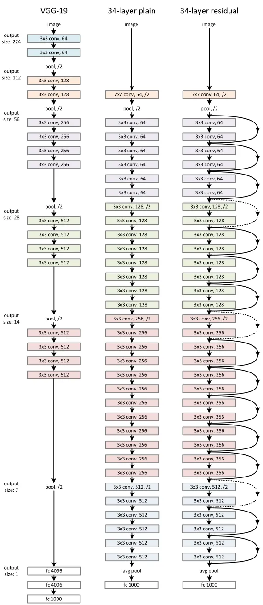

# ResNet

## Original Paper

[Deep Resdual Learning for Image Recognition](https://arxiv.org/pdf/1512.03385.pdf)

1. Introduction:
    - When deeper nerworks are able to start converging, accuracy gets saturated and then degrades rapidly, which is not caused by overfitting. Adding more layers to a suitably deep model leads to higher training error.
    - Deep residual learning framework:

        ```text
                    x ||----------------+
                      \/                |
            +--------------------+      |
            |    weight layer    |      |
            +--------------------+      |
                      ||  relu          |
                      \/                |
            +--------------------+      |
            |    weight layer    |      |
            +--------------------+      |
                      ||                |
                      \/                |
                    +----+              |
          F(x) + x  | +  |<-------------+
                    +----+
                      ||  relu
                      \/  
        ```

2. ResNet 34 Architecture:



## PyTorch Version

[resnet.py (Different scale of ResNet included)](https://github.com/weiaicunzai/pytorch-cifar100/blob/master/models/resnet.py)

```python
# ResNet34 below

import torch
import torch.nn as nn

class BasicBlock(nn.Module):
    expansion = 1
    """Basic block for resnet 18 and 34"""
    def __init__(self, in_channels, out_channels, stride=1):
        super.__init__()

        # residual function
        self.residual_funtion = nn.Sequential(
            nn.Conv2d(in_channels, out_channels, kernel_size=3, stride=stride, padding=1, bias=False),
            nn.BatchNorm2d(out_channels),
            nn.ReLU(inplace=True),
            nn.Conv2d(out_channels, out_channels * BasicBlock, kernel_size=3, padding=1, bias=False),
            nn.BatchNorm2d(out_channels * BasicBolck.expansion)
        )

        self.shortcut = nn.Sequential()

        if stride != 1 or in_channels != BasicBlock.expansion * out_channels:
            self.shortcut = nn.Sequential(
                nn.Conv2d(in_channels, out_channels * BackBlock.expansion, kernel_size=1, stride=stride, bias=False),
                nn.BatchNorm2d(out_channels * BasicBlock.expansion)
            )

class RenNet34(nn.Module):
    def __init__(self, block, num_block, num_classes=100):
        super.__init__()

        self.in_channels = 64

        self.conv1 = nn.Sequential(
            nn.Conv2d(3, 64, kernel_size=3, padding=1, bias=False),
            nn.BatchNorm2d(64),
            nn.ReLU(inplace=True)
        )

        self.conv2_x = self._make_layer(block, 64, 3, 1)
        self.conv3_x = self._make_layer(block, 64, 4, 2)
        self.conv4_x = self._make_layer(block, 64, 6, 2)
        self.conv5_x = self._make_layer(block, 64, 3, 2)
        self.avg_pool = nn.AdaptiveAvgPool2d((1, 1))
        self.fc = nn.Linear(512 * block.expansion, num_classes)

    def _make_layer(self, block, out_channels, num_blocks, stride):
        striders = [stride] + [1] * [num_blocks - 1]
        layers = []
        for stride in strides:
            layers.append(block(self.in_channels, out_channels, stride))
            self.in_channels = out_channels * block.expansion
        
        return nn.Sequential(*layers)

    def forward(self, x):
        output = self.conv1(x)
        output = self.conv2_x(output)
        output = self.conv3_x(output)
        output = self.conv4_x(output)
        output = self.conv5_x(output)
        output = self.avg_pool(output)
        outptu = output.view(output.size(0), -1)
        output = self.fc(outpt)

        return output
```

## Jittor Version

1. Code:

    ```python
    import jittor
    import os
    from jittor import nn, Module
    import numpy as np
    from tqdm import tqdm
    from jittor.dataset import CIFAR100
    import jittor.transform as transforms

    # Parameters
    data_root = '~/.cache/'
    batch_size = 64
    lr = 1e-2
    momentum = 0.9
    epochs = 200
    img_size = 64

    jittor.flags.use_cuda = 1

    transform = transforms.Compose([
        transforms.RandomCrop(28),
        transforms.RandomHorizontalFlip(),
        transforms.Resize(size=img_size),
        transforms.ImageNormalize(mean=[0.5, 0.5, 0.5], std=[0.5, 0.5, 0.5])
    ])

    # Use Cifar100 dataset
    train_loader = CIFAR100(os.path.expanduser(data_root), train=True, transform=transform, download=True).set_attrs(batch_size=batch_size, shuffle=True)
    test_loader = CIFAR100(os.path.expanduser(data_root), train=False, transform=transform, download=True).set_attrs(shuffle=True)
    print(f'Dataset loaded with trainging dataset with a batchsize of {train_loader.batch_size}')

    # Model Defination
    # Basic block of ResNet 34
    class BasicBlock(Module):
        def __init__(self, in_channels, out_channels, stride=1):
            super(BasicBlock, self).__init__()

            self.residual_func = nn.Sequential(
                nn.Conv(in_channels=in_channels, out_channels=out_channels, kernel_size=3, stride=stride, padding=1 ,bias=False),
                nn.BatchNorm(out_channels),
                nn.ReLU(),
                nn.Conv(in_channels=out_channels, out_channels=out_channels, kernel_size=3, padding=1, bias=False),
                nn.BatchNorm(out_channels)
            )

            self.short_cut = nn.Sequential()

            if stride != 1 or in_channels != out_channels:
                self.short_cut = nn.Sequential(
                    nn.Conv(in_channels=in_channels, out_channels=out_channels, kernel_size=1, stride=stride, bias=False),
                    nn.BatchNorm(out_channels)
                )

        def execute(self, x):
            output = self.residual_func(x) + self.short_cut(x)
            output = nn.relu(output)
            return output

    # ResNet 34
    class ResNet34(Module):
        def __init__(self, block, num_classes=100):
            super(ResNet34, self).__init__()

            self.in_channels = 64

            self.conv1 = nn.Sequential(
                nn.Conv(3, 64, kernel_size=3, padding=1, bias=False),
                nn.BatchNorm(64),
                nn.ReLU()
            )
            self.conv2_x = self.make_layer(block, 64, 3, 1)
            self.conv3_x = self.make_layer(block, 128, 4, 2)
            self.conv4_x = self.make_layer(block, 256, 6, 2)
            self.conv5_x = self.make_layer(block, 512, 3, 2)

            self.avg_pool = nn.AdaptiveAvgPool2d(1)
            self.fc = nn.Linear(512, num_classes)
        
        def make_layer(self, block, out_channels, num_blocks, stride):
            strides = [stride] + [1] * (num_blocks - 1)
            layers = []
            for stride in strides:
                layers.append(block(self.in_channels, out_channels, stride))
                self.in_channels = out_channels

            return nn.Sequential(*layers)
        
        def execute(self, x):
            output = self.conv1(x)
            output = self.conv2_x(output)
            output = self.conv3_x(output)
            output = self.conv4_x(output)
            output = self.conv5_x(output)
            output = self.avg_pool(output)
            output = output.view(output.shape[0], -1)
            output = self.fc(output)
            return output

    def train(model, train_loader, loss_func, optimizer, epoch, f):
        model.train()

        for batch_idx, (inputs, labels) in enumerate(train_loader):
            outputs = model(inputs)
            loss = loss_func(outputs, labels)
            optimizer.step(loss)
            data = f'Train epoch {epoch} [{(batch_idx + 1) * batch_size}/{len(train_loader)}]\tLoss: {loss.numpy()[0]}'
            print(data)
            f.write(data + '\n')

    all_acc = []

    def test(model, test_loader, epoch, f):
        model.eval()

        correct = 0
        total = 0
        accuracy = []

        for batch_idx, (inputs, labels) in tqdm(enumerate(test_loader)):
            batch_size = inputs.shape[0]
            outputs = model(inputs)
            pred = np.argmax(outputs.data, axis=1)
            acc = np.sum(labels.data==pred)
            correct += acc
            total += batch_size
            accuracy.append(acc / batch_size * 100)
        
        all_acc.append(sum(accuracy) / len(accuracy))
        data = f'Test epoch {epoch} accuracy: {sum(accuracy) / len(accuracy)}%'
        print(data)
        f.write(data + '\n')

    if __name__ == '__main__':
        with open('Result_3_14_2.txt', 'w') as f:
            resnet34 = ResNet34(BasicBlock, 100)
            loss_func = nn.CrossEntropyLoss()
            optimizer = nn.SGD(params=resnet34.parameters(), lr=lr, momentum=momentum)

            for epoch in range(epochs):
                train(resnet34, train_loader, loss_func, optimizer, epoch, f)
                test(resnet34, test_loader, epoch, f)
                if(all_acc[len(all_acc) - 1] >= max(all_acc)):
                    resnet34.save('./resnet34.pkl')

            print(f'Accuracy on all data in each epoch: {all_acc}')
            f.write(f'Accuracy on all data in each epoch: {all_acc}\n')
    ```

    Main function of Version 4 is a little bit different.

    ```python
    if __name__ == '__main__':
        with open('Result.txt', 'w') as f:
            # Load pretrained model
            resnet34 = ResNet34(BasicBlock, 100)
            resnet34.load_state_dict(jittor.load('./resnet34.pkl'))
            mydict = resnet34.state_dict()
            for k, v in mydict.items():
                print('k===', k, 'v==', v)
                
            models = resnet34.modules()
            for p in models:
                if p._get_name() != 'Linear':
                    print(p._get_name())
                    f.write(p._get_name())
                    p.requires_grad_ = False

            loss_func = nn.CrossEntropyLoss()
            optimizer = nn.SGD(params=resnet34.parameters(), lr=lr, momentum=momentum)

            for epoch in range(epochs):
                train(resnet34, train_loader, loss_func, optimizer, epoch, f)
                test(resnet34, test_loader, epoch, f)
                if(all_acc[len(all_acc) - 1] >= max(all_acc)):
                    resnet34.save('./resnet34_3_14_2.pkl')

            print(f'Accuracy on all data in each epoch: {all_acc}')
            f.write(f'Accuracy on all data in each epoch: {all_acc}\n')
    ```

2. Accuracy:
    - Version 1: Default parameters with a cccuracy of 61.5% approximately.
    - Version 2: Maxpooling added in conv1, data cropped at random, image size 32, about 66.5%.
    - Version 3: Maxpooling removed, data cropped at random, image size 64, lr=0.01, about 74.5%.
    - Version 4: Trained twice with accuracy improved 0.5% to 1.0% approximately.
3. Reference for training:
    - [ResNet Training on CIFAR10 (P1)](https://www.cnblogs.com/zhengbiqing/p/10432169.html)
    - [ResNet Training on CIFAR10 (P2)](https://www.cnblogs.com/zhengbiqing/p/10434681.html)
    - [ResNet Training on CIFAR10 (P3)](https://www.cnblogs.com/zhengbiqing/p/10435593.html)
    - [ResNet Training on CIFAR100](https://blog.csdn.net/lillllllll/article/details/120144173)
