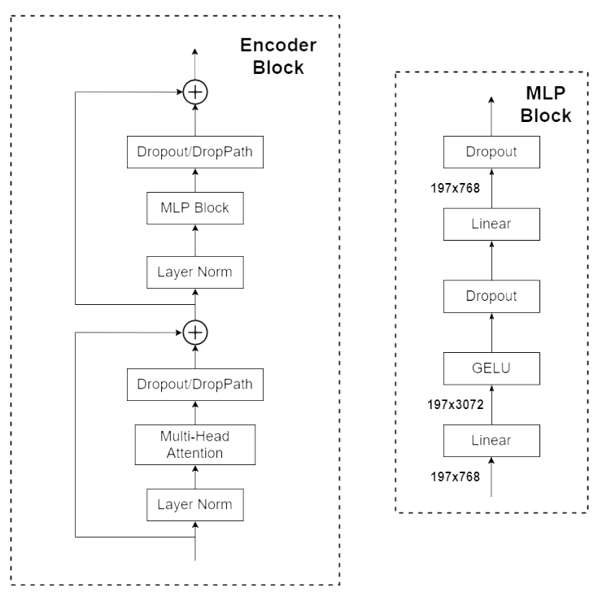

# Vision Transformer (ViT)

## Source

1. [Vision-Transformer-ViT_asyml](https://github.com/asyml/vision-transformer-pytorch)
2. [Vision-Transformer-ViT_Kaicheng-Yang0828](https://github.com/Kaicheng-Yang0828/Vision-Transformer-ViT)

## Original Paper

[An Image Is Worth 16x16 Words: Transformer for Image Recongnition at Scale](https://arxiv.org/pdf/2010.11929.pdf)

## Video

[Interpretation of ViT](https://www.bilibili.com/video/BV15P4y137jb?vd_source=f913c8d5eba4923e55076f4509271cd9)

## Referrence

[Vision Transformer Details](https://blog.csdn.net/qq_37541097/article/details/118242600)

## Architecture


1. Linear Projection of Flattened Patches(Embedding Layer):
    - For the standard Transformer module, the input is required to be a sequence of vectors(a 2d matrix `[num_vectors, dim_vectors]`).
    - For image data, the data format is `[H, W, C]`, which is not accepted by Tansformer. Therefore, an `Embedding Layer` is needed to do a transformation on the data.
    - Take ViT-B16 as an example, the input image(256x256) is divided into 196 16x16 patches. Then each patch is mapped to a one-dimensional vector by a linear mapping(In ViT-B16, that is from `[16, 16, 3]` to `[768]`.). In the code implementation, this is done directly through a convolutional layer.

        ```text
                        Original image [224, 244, 3]
                                      ||
                                      \/
        Conv(kernel_size=16, stride=16, input_channels=3, output_channels=768)
                                      ||
                                      \/
                              [14, 14, 768] Tensor
                                      ||
                                      \/
                               [196, 768] Tensor
        ```

    - Adding `[class] token` as well as `Position Embedding` before entering the Transformer Encoder is needed. `[class]token` is a trainable parameter(a vector). Take ViT-B16 as an example, `[class]token` is a vector of length 768, stitched together with the tokens previously generated from the picture: `Car([1, 768], [196, 768]) -> [197, 768]`. `Position Embedding` is alaso a trainable paramter(shape: `[197, 768]`).
    - As a conclusion, the out put of the Embedding Layer is a `[patches_num + 1, output_channels]` tensor.
2. Transformer Encoder - Stack of Encoder Block
    
3. MLP Head(Used for eventual classification)
    - All we need is the classification information. Therefore, only the corresponding result generated by `[class]token` needs to be extracted. (In ViT-B16, that is extracting `[1, 768]` from `[197, 768]`.)
    - Let the extracted tensor be the input of MLP Head, the output should be the final classification result.

## Implementation

1. PyTorch Version: [model.py from asyml's github](https://github.com/asyml/vision-transformer-pytorch/blob/main/src/model.py)

    ```python
    import torch
    import torch.nn as nn
    import torch.nn.functional as F
    import numpy as np

    class PositionEmbs(nn.Module):
        def __init__(self, num_patches, emb_dim, dropout_rate=0.1):
            super(PositionEmbs, self).__init__()
            self.pos_embedding = nn.Parameter(torch.randn(1, num_patches + 1, emb_dim))
            if dropout_rate > 0:
                self.dropout = nn.Dropout(dropout_rate)
            else:
                self.dropout = None

        def forward(self, x):
            out = x + self.pos_embedding

            if self.dropout:
                out = self.dropout(out)

            return out


    class MlpBlock(nn.Module):
        """ Transformer Feed-Forward Block """
        def __init__(self, in_dim, mlp_dim, out_dim, dropout_rate=0.1):
            super(MlpBlock, self).__init__()

            # init layers
            self.fc1 = nn.Linear(in_dim, mlp_dim)
            self.fc2 = nn.Linear(mlp_dim, out_dim)
            self.act = nn.GELU()
            if dropout_rate > 0.0:
                self.dropout1 = nn.Dropout(dropout_rate)
                self.dropout2 = nn.Dropout(dropout_rate)
            else:
                self.dropout1 = None
                self.dropout2 = None

        def forward(self, x):

            out = self.fc1(x)
            out = self.act(out)
            if self.dropout1:
                out = self.dropout1(out)

            out = self.fc2(out)
            out = self.dropout2(out)
            return out


    class LinearGeneral(nn.Module):
        def __init__(self, in_dim=(768,), feat_dim=(12, 64)):
            super(LinearGeneral, self).__init__()

            self.weight = nn.Parameter(torch.randn(*in_dim, *feat_dim))
            self.bias = nn.Parameter(torch.zeros(*feat_dim))

        def forward(self, x, dims):
            a = torch.tensordot(x, self.weight, dims=dims) + self.bias
            return a


    class SelfAttention(nn.Module):
        def __init__(self, in_dim, heads=8, dropout_rate=0.1):
            super(SelfAttention, self).__init__()
            self.heads = heads
            self.head_dim = in_dim // heads
            self.scale = self.head_dim ** 0.5

            self.query = LinearGeneral((in_dim,), (self.heads, self.head_dim))
            self.key = LinearGeneral((in_dim,), (self.heads, self.head_dim))
            self.value = LinearGeneral((in_dim,), (self.heads, self.head_dim))
            self.out = LinearGeneral((self.heads, self.head_dim), (in_dim,))

            if dropout_rate > 0:
                self.dropout = nn.Dropout(dropout_rate)
            else:
                self.dropout = None

        def forward(self, x):
            b, n, _ = x.shape

            q = self.query(x, dims=([2], [0]))
            k = self.key(x, dims=([2], [0]))
            v = self.value(x, dims=([2], [0]))

            q = q.permute(0, 2, 1, 3)
            k = k.permute(0, 2, 1, 3)
            v = v.permute(0, 2, 1, 3)

            attn_weights = torch.matmul(q, k.transpose(-2, -1)) / self.scale
            attn_weights = F.softmax(attn_weights, dim=-1)
            out = torch.matmul(attn_weights, v)
            out = out.permute(0, 2, 1, 3)

            out = self.out(out, dims=([2, 3], [0, 1]))

            return out


    class EncoderBlock(nn.Module):
        def __init__(self, in_dim, mlp_dim, num_heads, dropout_rate=0.1, attn_dropout_rate=0.1):
            super(EncoderBlock, self).__init__()

            self.norm1 = nn.LayerNorm(in_dim)
            self.attn = SelfAttention(in_dim, heads=num_heads, dropout_rate=attn_dropout_rate)
            if dropout_rate > 0:
                self.dropout = nn.Dropout(dropout_rate)
            else:
                self.dropout = None
            self.norm2 = nn.LayerNorm(in_dim)
            self.mlp = MlpBlock(in_dim, mlp_dim, in_dim, dropout_rate)

        def forward(self, x):
            residual = x
            out = self.norm1(x)
            out = self.attn(out)
            if self.dropout:
                out = self.dropout(out)
            out += residual
            residual = out

            out = self.norm2(out)
            out = self.mlp(out)
            out += residual
            return out


    class Encoder(nn.Module):
        def __init__(self, num_patches, emb_dim, mlp_dim, num_layers=12, num_heads=12, dropout_rate=0.1, attn_dropout_rate=0.0):
            super(Encoder, self).__init__()

            # positional embedding
            self.pos_embedding = PositionEmbs(num_patches, emb_dim, dropout_rate)

            # encoder blocks
            in_dim = emb_dim
            self.encoder_layers = nn.ModuleList()
            for i in range(num_layers):
                layer = EncoderBlock(in_dim, mlp_dim, num_heads, dropout_rate, attn_dropout_rate)
                self.encoder_layers.append(layer)
            self.norm = nn.LayerNorm(in_dim)

        def forward(self, x):

            out = self.pos_embedding(x)

            for layer in self.encoder_layers:
                out = layer(out)

            out = self.norm(out)
            return out


    class VisionTransformer(nn.Module):
        """ Vision Transformer """
        def __init__(self,
                    image_size=(256, 256),
                    patch_size=(16, 16),
                    emb_dim=768,
                    mlp_dim=3072,
                    num_heads=12,
                    num_layers=12,
                    num_classes=1000,
                    attn_dropout_rate=0.0,
                    dropout_rate=0.1,
                    feat_dim=None):
            super(VisionTransformer, self).__init__()
            h, w = image_size

            # embedding layer
            fh, fw = patch_size
            gh, gw = h // fh, w // fw
            num_patches = gh * gw
            self.embedding = nn.Conv2d(3, emb_dim, kernel_size=(fh, fw), stride=(fh, fw))
            # class token
            self.cls_token = nn.Parameter(torch.zeros(1, 1, emb_dim))

            # transformer
            self.transformer = Encoder(
                num_patches=num_patches,
                emb_dim=emb_dim,
                mlp_dim=mlp_dim,
                num_layers=num_layers,
                num_heads=num_heads,
                dropout_rate=dropout_rate,
                attn_dropout_rate=attn_dropout_rate)

            # classfier
            self.classifier = nn.Linear(emb_dim, num_classes)

        def forward(self, x):
            emb = self.embedding(x)     # (n, c, gh, gw)
            emb = emb.permute(0, 2, 3, 1)  # (n, gh, hw, c)
            b, h, w, c = emb.shape
            emb = emb.reshape(b, h * w, c)

            # prepend class token
            cls_token = self.cls_token.repeat(b, 1, 1)
            emb = torch.cat([cls_token, emb], dim=1)

            # transformer
            feat = self.transformer(emb)

            # classifier
            logits = self.classifier(feat[:, 0])
            return logits
    ```

2. Jittor Version(training from scratch):

    ```python
    import jittor as jt
    import os
    from jittor import nn, Module
    import jittor.transform as transforms
    import numpy as np
    from tqdm import tqdm
    from jittor.dataset import CIFAR100
    from jittor_attention import MultiheadAttention
    import time

    data_root = '~/.cache/'
    batch_size = 64
    lr = 1e-2
    momentum = 0.9
    epochs = 200

    jt.flags.use_cuda = 1

    transform = transforms.Compose([
        # transforms.RandomCrop(28),
        # transforms.RandomHorizontalFlip(),
        transforms.Resize(size=(256, 256)),
        transforms.ImageNormalize(mean=[0.5, 0.5, 0.5], std=[0.5, 0.5, 0.5])
    ])

    # Use Cifar100 dataset
    train_loader = CIFAR100(os.path.expanduser(data_root), train=True, transform=transform, download=True).set_attrs(batch_size=batch_size, shuffle=True)
    test_loader = CIFAR100(os.path.expanduser(data_root), train=False, transform=transform, download=True).set_attrs(shuffle=True)

    class PositionalEmbedding(Module):
        def __init__(self, num_patches, emb_dim, dropout_rate=0.1):
            super(PositionalEmbedding, self).__init__()
            self.pos_embedding = nn.Parameter(jt.randn(1, num_patches + 1, emb_dim))
            if dropout_rate > 0.0:
                self.dropout = nn.Dropout(dropout_rate)
            else:
                self.dropout = None

        def execute(self, x):
            output = x + self.pos_embedding
            if self.dropout:
                output = self.dropout(output)
            return output

    class MLPBlock(Module):
        def __init__(self, in_dim, mlp_dim, out_dim, dropout_rate=0.1):
            super(MLPBlock, self).__init__()

            self.fc1 = nn.Linear(in_dim, mlp_dim)
            self.fc2 = nn.Linear(mlp_dim, out_dim)
            self.act = nn.GELU()
            if dropout_rate > 0.0:
                self.dropout1 = nn.Dropout(dropout_rate)
                self.dropout2 = nn.Dropout(dropout_rate)
            else:
                self.dropout1 = None
                self.dropout2 = None

        def execute(self, x):
            output = self.fc1(x)
            output = self.act(output)
            if self.dropout1:
                output = self.dropout1(output)
            output = self.fc2(output)
            if self.dropout2:
                output = self.dropout2(output)
            
            return output

    class EncoderBlock(Module):
        def __init__(self, in_dim, mlp_dim, num_heads, dropout_rate=0.1, attn_dropout_rate=0.1):
            super(EncoderBlock, self).__init__()

            self.norm1 = nn.LayerNorm(in_dim)
            self.attn = MultiheadAttention(embed_dim=in_dim, num_heads=num_heads, dropout=attn_dropout_rate, batch_first=True)
            if dropout_rate > 0.0:
                self.dropout = nn.Dropout(dropout_rate)
            else:
                self.dropout = None
            self.norm2 = nn.LayerNorm(in_dim)
            self.mlp = MLPBlock(in_dim, mlp_dim, in_dim, dropout_rate)

        def execute(self, x):
            residual = x
            output = self.norm1(x)
            output = self.attn(output, output, output)
            if self.dropout:
                output = self.dropout(output[0])
            output += residual
            residual = output

            output = self.norm2(output)
            output = self.mlp(output)
            output += residual

            return output

    class Encoder(Module):
        def __init__(self, num_patches, emb_dim, mlp_dim, num_layers=12, num_heads=12, dropout_rate=0.1, attn_dropout_rate=0.0):
            super(Encoder, self).__init__()
            
            self.pos_embdding = PositionalEmbedding(num_patches, emb_dim, dropout_rate)

            in_dim = emb_dim
            self.encoder_layers = nn.ModuleList()
            for i in range(num_layers):
                layer = EncoderBlock(in_dim, mlp_dim, num_heads, dropout_rate, attn_dropout_rate)
                self.encoder_layers.append(layer)
            self.norm = nn.LayerNorm(in_dim)
        
        def execute(self, x):
            output = self.pos_embdding(x)
            
            for layer in self.encoder_layers:
                output = layer(output)

            output = self.norm(output)

            return output

    class VisionTransformer(Module):
        def __init__(self,
                    img_size=(256, 256),
                    patch_size=(16, 16),
                    emb_dim=768,
                    mlp_dim=3072,
                    num_heads=12,
                    num_layers=12,
                    num_classes=100,
                    attn_dropout_rate=0.0,
                    dropout_rate=0.1,
                    feat_dim=None):
            super(VisionTransformer, self).__init__()
            h, w = img_size

            # embedding layer
            fh, fw = patch_size
            gh, gw = h // fh, w // fw
            num_patches = gh * gw
            self.embedding = nn.Conv(3, emb_dim, kernel_size=(fh, fw), stride=(fh, fw))

            # class token
            self.cls_token = nn.Parameter(jt.zeros(1, 1, emb_dim))

            # transfromer encoder
            self.encoder = Encoder(
                num_patches,
                emb_dim,
                mlp_dim,
                num_layers,
                num_heads,
                dropout_rate,
                attn_dropout_rate)
            
            # classifier (MLP Head is not used)
            self.classifier = nn.Linear(emb_dim, num_classes)

        def execute(self, x):
            emb = self.embedding(x)
            emb = emb.permute(0, 2, 3, 1)
            b, h, w, c = emb.shape
            emb = emb.reshape(b, h * w, c)

            cls_token = self.cls_token.repeat(b, 1, 1)
            emb = jt.cat([cls_token, emb], dim=1)

            feat = self.encoder(emb)

            logits = self.classifier(feat[:, 0])

            return logits
        
    all_acc = []

    def train(model, train_loader, loss_func, optimizer, epoch, f):
        t1 = time.time()
        loss_epoch = []

        model.train()

        for batch_idx, (inputs, labels) in enumerate(train_loader):
            outputs = model(inputs)
            loss = loss_func(outputs, labels)
            optimizer.step(loss)
            loss_epoch.append(loss.numpy()[0])
            data = f'Train epoch {epoch} [{(batch_idx + 1) * batch_size}/{len(train_loader)}]\tLoss: {loss.numpy()[0]}'
            print(data)
            f.write(data + '\n')
        t2 = time.time()
        data = data = f'Train epoch {epoch} average loss: {sum(loss_epoch) / len(loss_epoch)}   Time cost: {(t2-t1)/6e7}min'
        print(data)
        f.write(data + '\n')

    def test(model, test_loader, epoch, f):
        model.eval()

        correct = 0
        total = 0
        accuracy = []

        for _, (inputs, labels) in tqdm(enumerate(test_loader)):
            batch_size = inputs.shape[0]
            outputs = model(inputs)
            pred = np.argmax(outputs.data, axis=1)
            acc = np.sum(labels.data==pred)
            correct += acc
            total += batch_size
            accuracy.append(acc / batch_size * 100)
        
        all_acc.append(sum(accuracy) / len(accuracy))
        data = f'Test epoch {epoch} accuracy: {sum(accuracy) / len(accuracy)}%'
        print(data)
        f.write(data + '\n')

    if __name__ == '__main__':
        with open('Res.txt', 'w') as f:
            vit = VisionTransformer()
            loss_func = nn.CrossEntropyLoss()
            optimizer = nn.SGD(params=vit.parameters(), lr=lr, momentum=momentum)

            for epoch in range(epochs):
                train(vit, train_loader, loss_func, optimizer, epoch, f)
                test(vit, test_loader, epoch, f)
                if(all_acc[len(all_acc) - 1] >= max(all_acc)):
                    vit.save('./ViT.pkl')

            print(f'Accuracy on all data in each epoch: {all_acc}')
            f.write(f'Accuracy on all data in each epoch: {all_acc}\n')
    ```

## Result

1. When training from scratch, the accuracy is not satisfying. (50%, 30 epoches approximately) The loss of the network declines extremely slow.
2. When training based on pretrained model, the accuracy reaches 98% after ont epoch using pytorch version from Kaicheng-Yang0828's github.
